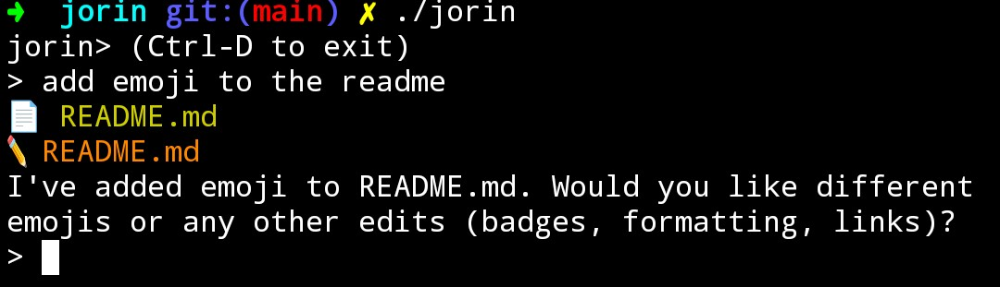

# `jorin`


Jorin is a small coding agent written in Go.

It calls tools, like `shell`, `read_file`, `write_file`,
`http_get` and communicates with an OpenAI-compatible API.
It is designed for use as a composable command-line tool for shell scripts
and also for interactive coding sessions.

Jorin isn't designed to be your day-to-day coding agent for big projects.
Instead, Jorin is designed to be ran in constrained environments like
containers and on mobile devices.
Jorin also serves as a research prototype for agent techniques such as
[Skills to Agents](https://dave.engineer/blog/2025/11/skills-to-agents/)
and [Agent Situations](https://github.com/dave1010/agent-situations).



## Documentation

- [Usage guide](docs/usage.md)
- [Development and architecture](docs/development.md)
- [Security notes](docs/security.md)
- [Contributing](CONTRIBUTING.md)
- [Code of conduct](CODE_OF_CONDUCT.md)
- [Changelog](CHANGELOG.md)

## Install

One line install:

```bash
curl -fsSL https://get.jorin.ai | bash
```

The installer will place `jorin` in `/usr/local/bin` when it can, otherwise it
uses `~/.local/bin` and updates your shell profile to add it to `$PATH`.
Set `JORIN_INSTALL_DIR` to override the install location.

## Manual install

Download the latest release for your platform from
[GitHub Releases](https://github.com/dave1010/jorin/releases).

Then add it to your $PATH.

## Configuration

Set your API key before running jorin:

```bash
export OPENAI_API_KEY="your-api-key"
```

To use a different OpenAI-compatible endpoint:

```bash
export OPENAI_BASE_URL="https://api.openai.com"
```

## Quick start

Show help:

```bash
jorin --help
```

Start the REPL (default when invoked with no args):

```bash
jorin
```

Send a single prompt:

```bash
jorin "Refactor function X to be smaller"
```

Pipe stdin into a prompt:

```bash
cat document.md | jorin "Summarize the text"
```

Run a Jorin prompt file (shebang optional):

```bash
./review-code.jorin --target src/
```

To force a literal prompt instead of loading a file, use `--prompt`:

```bash
jorin --prompt "./review-code.jorin --target src/"
```

Enable Ralph Wiggum loop mode (iterative, self-referential AI loops that
auto-repeat until DONE or max tries):

```bash
jorin --ralph --ralph-max-tries 6 "Build a hello world API"
```

## Contributing

Please read [CONTRIBUTING.md](CONTRIBUTING.md) and follow the
[Code of Conduct](CODE_OF_CONDUCT.md).

## License

MIT

## Colophon

"Jorin" is pronounced "jorin", not "JOR-in" or "jor-IN". Say it quickly, but not so quickly that it feels rushed: Jorin. That's it! The name comes from looking at my keyboard and trying to find something without too many Google results.
